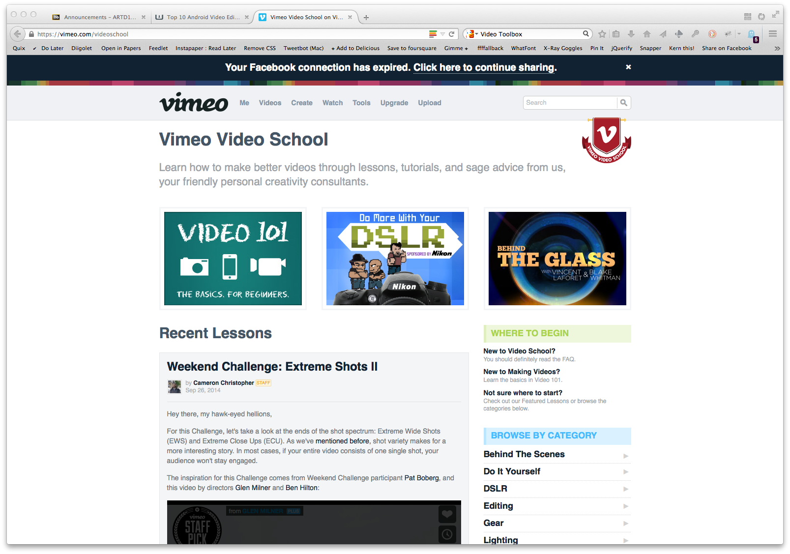
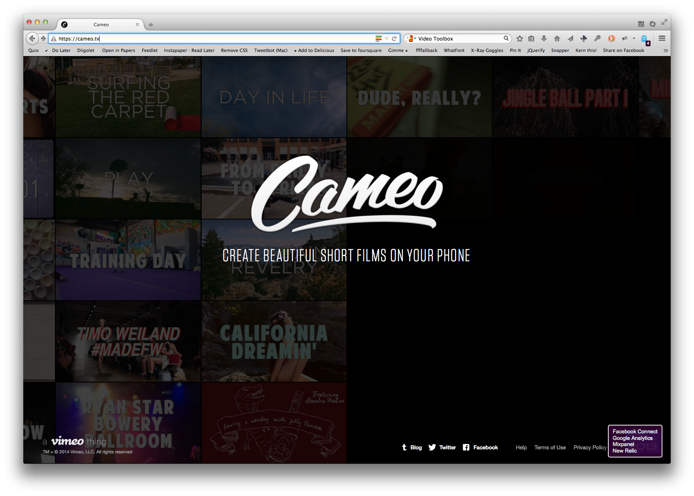
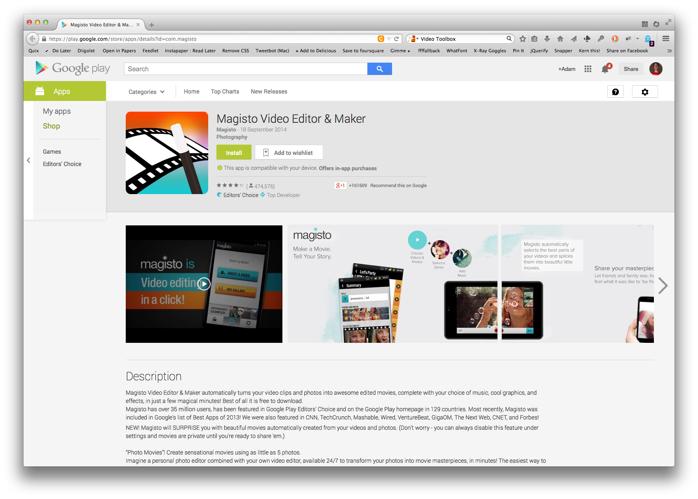
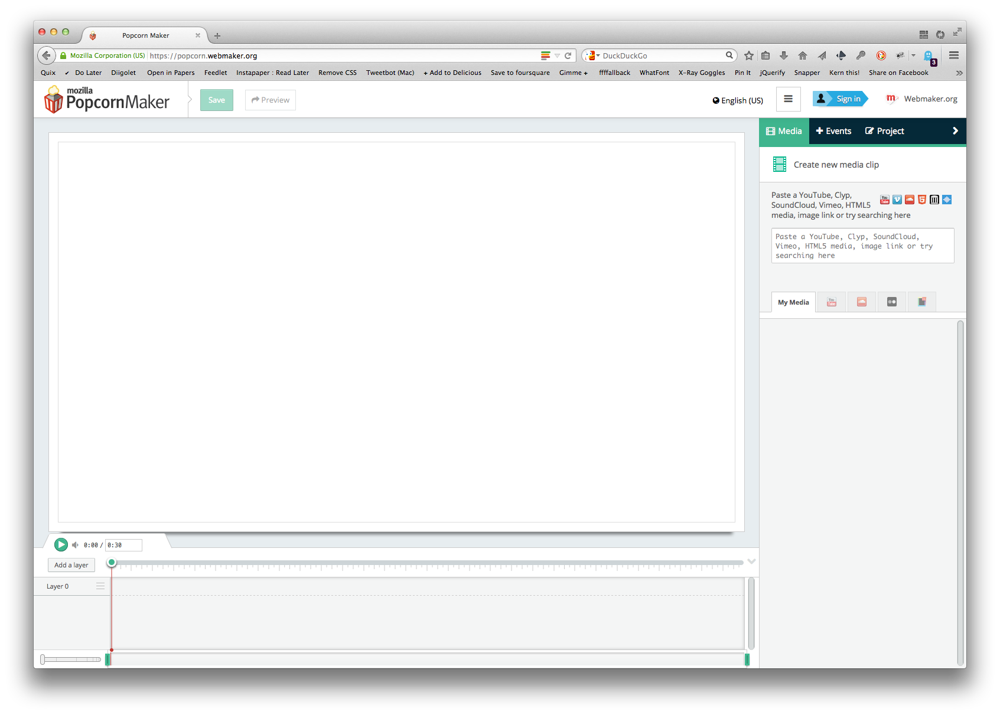
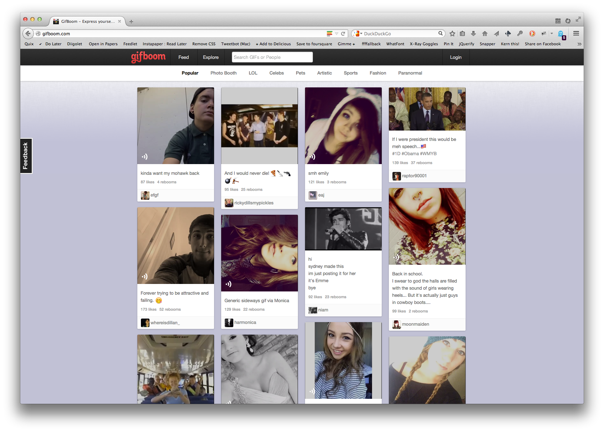
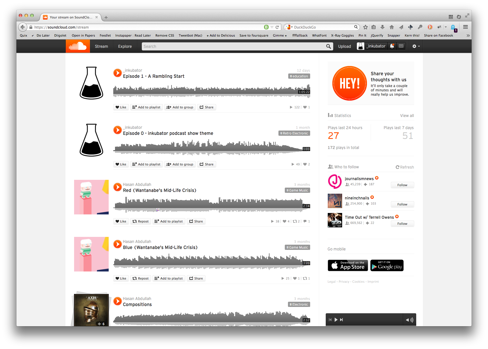
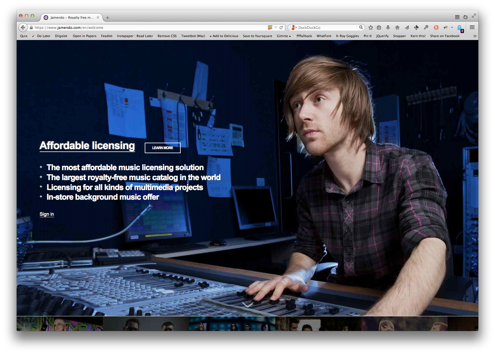
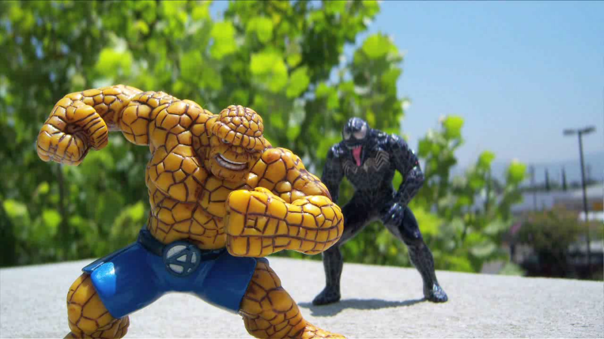

slidenumbers: true
^ footer: Adam Procter

# Orientation Project
## Project 0_0

### Task

Working in groups you will create a four minute film that communicates your impression of Winchester and the surrounding areas. This should incorporate at least two of the set activities and be presented to fellow students on Friday.

---
## Content is king

Does not need to be _slick_
Needs to Communication
- Fun
- Informative


---

## Style

It can be fictious or documentary, up to you, your take, your impression, your pov, your film


---

# Resources

Vimeo Video School
http://vimeo.com/videoschool/101



---
Cameo by Vimeo, LLC 
https://appsto.re/gb/_tRSQ.i
http://cameo.tv



---
Magisto Video Editor & Maker
https://play.google.com/store/apps/details?id=com.magisto



---

Online web video editor
https://popcorn.webmaker.org



---
GifBoom by TapMojo LLC
https://appsto.re/gb/L_orB.i



 ---
 
SoundCloud - Music & Audio by SoundCloud Ltd.
https://appsto.re/gb/_Dfdu.i



 ---
 
Creative Commons licensed music
http://jamendo.com
http://search.creativecommons.org



--- 


# Examples



```
Bathroom
http://vimeo.com/3539824

Fragments of Iceland
http://vimeo.com/40558553

Gnarly in Pink
https://vimeo.com/99185645

Slowmo
https://vimeo.com/59749737
```

---
# All on Vimeo

I would like all the films online for our viewing at 14:00 Friday

- We will then head to GA studio 


---
# The Banquet
### After screenings

- food
- drink
- games (board)

---

### Assessment 
Final summative assessment will take place at the end of the first semester on the 15th of January 2015

