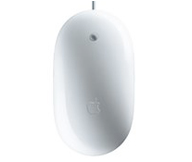

slidenumbers: true
^ footer: Adam Procter

# 1_2 Analyse & Interpret 

---

# Saul Bass

> "It seems to me that the creative process is one that  re-examines those things we already know and understand, and forces us to reconsider them, usually involving insight to their nature. The creative act is an act that transforms the ordinary into the extraordinary." 
-- Saul Bass

---

## Examine & interpret your Research from the British Museum

---

# Examine

---

# Look for

Commonly occurring

colours/ materials/ textures / 
symbolic iconography/ 
decorative elements/ letterforms

---

---

---

---

---

---

---

---

---

---

---

---

---

^ visual exploration

---

---

---

---

# Categorise & organise

---

^  Mark Dion’s work for the way he uses hierarchy and ordering within his work

---

---

---

---

---

---

---

#  Deconstruct and Simplify

---

^ Apple application/ Apple University Taking a Cue From Picasso
Apple has religiously embodied the notion that function and beauty come from elegant simplicity, and teachers in its internal training program sometimes point to a collection of Picasso lithographs that artfully illustrate the drive to boil down an idea to its most essential components.

---

---

^ Apple application/ Apple University /  Taking a Cue From Picasso
Apple has religiously embodied the notion that function and beauty come from elegant simplicity, and teachers in its internal training program sometimes point to a collection of Picasso lithographs that artfully illustrate the drive to boil down an idea to its most essential components.

---

---

---

---

---

---

---

# Interpret:

- To explain the meaning of...
- To conceive the significance of...
- To present or conceptualise.
- To translate orally (or visually).
- To offer an explanation.

^ methods to do this ? Monday's workshop

---

^ artefact explains the culture / listen to all the stories come from an object / tell stories / could be told via game

---
# Search
## Semiotics

---
# Read
## Barthes, R. (1993) Mythologies. Random House.

---

# Understand and identify

values, rituals & belief systems.

How might these be represented in visual form?

^ key understand this - maybe monday Afternoon word -> visual  slide with visual examples/ possibly using abstract logos or symbols / http://www.mariowiki.com/Super_Mario_Bros.

---

---

# Define

Start to consider a set of parameters/ rules/ values from which you might start to extrapolate visuals, objects and characters that could form components for a the _world_

###### _(this is not to recreate "Africa", but using just the evidence a new world can be created from your visual thinking)_

^ rules/ parameters/ how he moves/ monument valley notes on experience versus mechanics

---

---

> We are designing a set of rules, not designing a game…you then go out and experience and make stories
> -- Sean Murray (No Mans Sky)

---

# Example
## Shepherd Fairey OBEY!

--- 

^ is the core idea that underpins the world he has created
propergander / power state control so to communicate this ideas he has used history to help him think about how to communicate that message / identifying visual conventions / has become part of society / visual short hand  / hand is politics / does not imitate (don’t use the egypt iconography - use the ideas to generate the new Visual) russuian consructivism

---

^ here are clues to mine stuff / Sheparh fairy angluar expressionist/ communism

---

---

^this informed 60’s - protest posters cuban - castro language

---

---

^ emory Douglas

---

---

^ Paris 1968 

---

---

---

---

---

---

---

^ all these elements combine to his Obey
visuals say / dictator/  interchanges language - creates a number of posters using the same visual messages / short hand

---

^ fill in flash
using food / tea to talk about England
COLOUR

---

---

---

# Assessment evidence

- A visual proposal of your new world/ environment outlining an interpretation of the culture you researched at the British Museum.
- All supporting work/ sketches/ notes/ photocopies etc – collated and bound.

---
 
#  Monday 10am
## Bring your evidence

###### (sketchbooks and resources from BM)

^	// Monday AM  - systems / aka how to organise materials in general     // PM   - workshop with materials